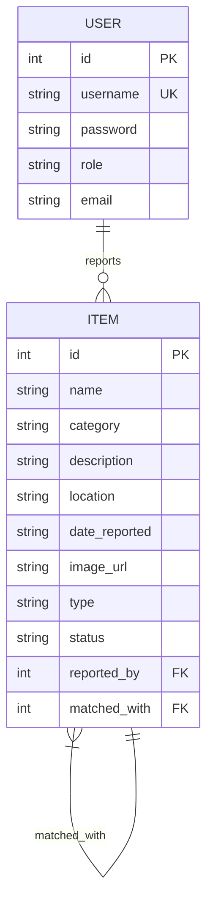
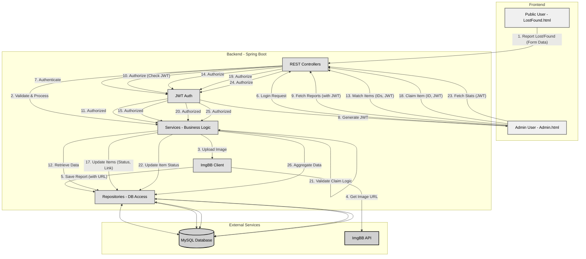

### **Team Members**

| Name                                        | Student ID    |
| ------------------------------------------- | ------------- |
| Ahmad Shukri Bin Bakri                      | B032310856    |
| Che Khuaimanfikri Bin Che Om                | B032310698    |
| Muhammad Haziq Bin Norizan                  | B032310357    |
| Muhammad Ammarul Arrif Bin Mohd Arrifin     | B032310874    |
| Muhammad Fikri Bin Abdullah                 | B032310813    |

 ### 📌 Project Overview

The Lost & Found Management System is a full-stack distributed web application designed for reporting and managing lost and found items within university environments. Built using Spring Boot , MySQL , and Vanilla JavaScript + HTML , this system provides both public-facing and admin-facing interfaces with real-time analytics, secure login mechanisms, and image handling via ImgBB API integration.

Students and staff often lose or find personal belongings on campus, and this project addresses this common challenge by providing a structured digital platform for seamless reporting, intelligent matching, efficient claiming processes, and comprehensive monitoring of lost and found items. The system serves as a centralized hub that connects individuals who have lost items with those who have found them, significantly improving recovery rates while reducing administrative burden on university staff.


### 💼 Commercial Value & Third-Party Integration

In real-world campus environments, this system significantly reduces administrative workload for staff members who traditionally handle lost and found operations manually, while simultaneously increasing the return rate of lost items through its efficient matching algorithms and user-friendly interface.

### 🔗 Integrated Third-Party Services

**ImgBB API**
- Purpose: Host uploaded item images
- Benefits: Reliable image storage and retrieval without burdening the main database

**JWT (JSON Web Tokens)**
- Purpose: Secure authentication and access control
- Benefits: Ensures system security and user role-based permissions

These third-party integrations enhance the system's scalability, security, and user experience while maintaining cost-effectiveness for educational institutions looking to implement modern lost and found management solutions.

## 🏗️ System Architecture

The Lost & Found Management System follows a client-server architecture with distributed components that work together to provide a seamless user experience.

### 📊 Architecture Diagram

graph TD
    A[LostFound.html (Public User)] -->|HTTP| C[Spring Boot Backend]
    B[Admin.html (Admin Panel)] -->|HTTP| C
    C --> D[(MySQL Database)]
    C --> E[ImgBB API]


### 🏗️ System Components

**Frontend Layer:**
- **Public Interface (LostFound.html):** Allows any university user to submit lost/found item reports and view existing reports
- **Admin Panel (Admin.html):** Provides administrative functions including item matching, claim management, and analytics dashboard

**Backend Layer:**
- **Spring Boot Application:** RESTful API server handling all business logic, authentication, and data processing
- **JWT Security:** Manages user authentication and authorization for protected endpoints

**Data Layer:**
- **MySQL Database:** Persistent storage for user accounts, item reports, and system data
- **ImgBB API:** External service for hosting and managing uploaded item images

**Communication:** All components communicate via HTTP/HTTPS protocols, with secure JWT-based authentication for protected admin functions.

## 🖥️ Backend Application

### 🧪 Technology Stack
- **Language:** Java 17
- **Framework:** Spring Boot 3.4.7
- **Database:** MySQL
- **Security:** JWT (JSON Web Tokens)
- **Libraries:** Spring Security, Spring Data JPA, Lombok, Jackson

### 📡 API Documentation

#### ✅ Main Endpoints
| Endpoint | Method | Description |
|----------|--------|-------------|
| `/api/report-lost` | POST | Submit lost item |
| `/api/report-found` | POST | Submit found item |
| `/api/reports` | GET | Retrieve all reports |
| `/api/match` | POST | Match lost & found items |
| `/api/claim/{id}` | PUT | Mark item as claimed |
| `/api/auth/login` | POST | Authenticate and receive JWT |
| `/api/stats/category` | GET | Lost items by category |
| `/api/stats/location` | GET | Lost items by location |
| `/api/stats/match-status` | GET | Matched vs unmatched stats |

## 🔐 Security

The Lost & Found Management System implements robust security measures to protect sensitive operations and ensure data integrity. All administrative endpoints including `/api/match`, `/api/claim/{id}`, and `/api/reports` are protected using JWT (JSON Web Tokens) Authentication.

### Authentication Flow
1. **User Login:** Administrators authenticate via `/api/auth/login` endpoint
2. **Token Generation:** System generates and returns a JWT upon successful authentication
3. **Token Usage:** Client includes the JWT in the Authorization header using the Bearer schema for all subsequent requests
4. **Token Validation:** Backend validates the JWT before processing sensitive operations

## 💻 Frontend Applications

### 🎯 1. LostFound.html (Public User Interface)
- **Purpose:** Allows any university user to submit and view reports
- **Stack:** HTML, CSS, Vanilla JavaScript
- **API Integration:** Uses fetch() to call endpoints:
  - `/api/report-lost`
  - `/api/report-found`
  - `/api/reports` (GET with filters)

### 🛠️ 2. Admin.html (Admin Panel)
- **Purpose:** Allows admin to view reports, manually match items, claim items, and view analytics
- **Stack:** HTML, CSS, Vanilla JavaScript, Chart.js
- **API Integration:** Authenticated fetch with JWT to endpoints:
  - `/api/reports`
  - `/api/claim/{id}`
  - `/api/match`
  - `/api/stats/*`

### 🗃️ Database Design

The Lost & Found Management System uses a relational database design to store user information, item reports, and related data. Below is an overview of the database schema, including entity-relationship diagrams and table structures.

### 📊 Entity-Relationship Diagram (ERD)

mermaid
Copy
Edit
erDiagram
    USER ||--o{ REPORT : has
    REPORT {
        Long id PK
        String name
        String category
        String description
        String location
        Date dateReported
        String type
        String status
        String imageUrl
        Long matchedWith FK (nullable)
    }
    USER {
        Long id PK
        String email
        String password
        String role
    }



The system consists of two main entities: `USER` and `ITEM`. The relationship between these entities is defined as follows:

- **USER**:
  - Each user can report multiple items.
  - Users have roles such as "admin" or "public" to manage access permissions.

- **ITEM**:
  - Each item is reported by a specific user (`reported_by` foreign key).
  - Items include details like name, category, description, location, date reported, image URL, type (lost/found), and status.

### 📝 Schema Justification

#### **USER Table**
- **id**: Primary Key (PK) - Unique identifier for each user.
- **username**: Unique Key (UK) - Ensures usernames are unique for login purposes.
- **password**: Stores hashed passwords for secure authentication.
- **role**: Defines user roles (e.g., admin, public) to control access levels.
- **email**: Optional field for user contact information.

#### **ITEM Table**
- **id**: Primary Key (PK) - Unique identifier for each item report.
- **name**: Name of the lost or found item.
- **category**: Category of the item (e.g., accessories, electronics).
- **description**: Detailed description of the item.
- **location**: Location where the item was found or lost.
- **date_reported**: Timestamp indicating when the item was reported.
- **image_url**: URL of the uploaded image hosted on ImgBB API.
- **type**: Indicates whether the item is "lost" or "found".
- **status**: Current status of the item (e.g., pending, matched, claimed).
- **reported_by**: Foreign Key (FK) linking to the `USER` table, indicating which user reported the item.

### 📜 Table Structures

#### **USER Table**
| Column Name | Data Type | Constraints |
|-------------|-----------|-------------|
| id          | int       | PK          |
| username    | string    | FK          |
| password    | string    |             |
| role        | string    |             |
| email       | string    |             |

#### **ITEM Table**
| Column Name   | Data Type | Constraints |
|---------------|-----------|-------------|
| id            | int       | PK          |
| name          | string    |             |
| category      | string    |             |
| description   | string    |             |
| location      | string    |             |
| date_reported | string    |             |
| image_url     | string    |             |
| type          | string    |             |
| status        | string    |             |
| reported_by   | int       | FK          |

### 🔗 Relationships
- **One-to-Many Relationship:** A single user (`USER`) can report multiple items (`ITEM`).
- **Foreign Key:** The `reported_by` column in the `ITEM` table references the `id` column in the `USER` table.

This database design ensures data integrity, scalability, and efficient querying for both user management and item reporting functionalities.

## 🔄 Business Logic & Validation

This section details the core operational rules and data integrity measures of the Lost & Found Management System.

### 🔄 Business Logic Flows

#### 1. General Workflow Diagram

This diagram shows the high-level interactions between users, the system components, and external services.

<!-- INSERT GENERAL WORKFLOW DIAGRAM HERE -->



### 🔁 Use Case Flows

1.  **Report Lost/Found Item:**
    *   User fills the form on `LostFound.html`.
    *   Image is uploaded to ImgBB API.
    *   Form data (including ImgBB URL) is submitted as JSON to the backend (`/api/report-lost` or `/api/report-found`).
    *   Backend validates data and stores the report in the `ITEM` table.

    <!-- INSERT SEQUENCE DIAGRAM HERE (Report Flow) -->

2.  **Admin Login & Access:**
    *   Admin submits credentials on `Admin.html`.
    *   Credentials are sent to `/api/auth/login`.
    *   On success, backend generates and returns a JWT.
    *   Frontend stores JWT and uses it in the `Authorization` header for subsequent requests to protected endpoints (`/api/reports`, `/api/match`, `/api/claim/{id}`, `/api/stats/*`).

    <!-- INSERT SEQUENCE DIAGRAM HERE (Login & Access Flow) -->

3.  **Match Items:**
    *   Admin views reports in `Admin.html`.
    *   Admin selects one "lost" item and one "found" item.
    *   Admin triggers the match action.
    *   Frontend sends a `POST` request to `/api/match` with IDs of the selected items.
    *   Backend validates the request (e.g., items exist, types are different, statuses allow matching).
    *   If valid, backend updates both items' `status` to "matched" and links them (e.g., using `matchedWith`).

4.  **Claim Item:**
    *   Admin identifies a matched item that has been physically claimed by its owner.
    *   Admin triggers the claim action for that item in `Admin.html`.
    *   Frontend sends a `PUT` request to `/api/claim/{id}`.
    *   Backend validates the request (e.g., item exists, status is "matched").
    *   If valid, backend updates the item's `status` to "claimed".

### ✅ Data Validation

Ensuring data accuracy and preventing invalid operations is crucial.

1.  **Frontend Validation (`LostFound.html`, `Admin.html`):**
    *   **Required Fields:** JavaScript checks prevent submission if essential fields (name, category, description, location, date) are empty.
    *   **File Upload:** Ensures an image is selected before submitting a report.
    *   **Basic Format Checks:** Simple checks for date format or valid characters before sending data.

2.  **Backend Validation (Spring Boot):**
    *   **Request Body Validation:** Uses `@Valid` with annotations (`@NotNull`, `@NotBlank`, `@Size`, etc.) on DTOs/Entities for endpoints like `/api/report-*`.
    *   **Data Integrity Checks:** Ensures dates are valid, strings are within limits.
    *   **Business Rule Enforcement:**
        *   Prevents matching items of the same type (e.g., lost with lost).
        *   Prevents matching items already matched or claimed.
        *   Prevents claiming items not marked as matched.
        *   Validates foreign key relationships (e.g., `reportedBy` user exists).
    *   **Security Validation:** JWT validation secures admin endpoints.

    <!-- INSERT IMAGE/GRAPH HERE (Validation Layers Diagram - e.g., Frontend vs Backend) -->

#### 📥 Request Example
```json
POST /api/report-lost
Content-Type: application/json

{
  "name": "Blue Wallet",
  "category": "Accessories",
  "description": "Left in cafeteria",
  "location": "Cafeteria",
  "dateReported": "2025-07-20",
  "imageUrl": "https://i.ibb.co/example.jpg  ",
  "type": "lost",
  "status": "pending",
  "reportedBy": 1
}

📤 Response (Success)
json
Copy
Edit
{
  "id": 12,
  "status": "pending",
  "type": "lost"
}
